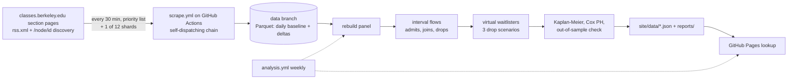
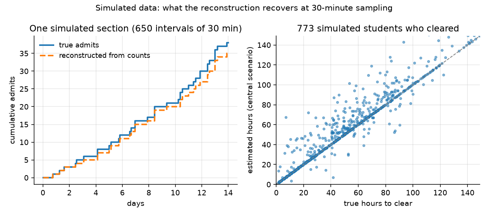

# Berkeley Waitlist Odds

Given a UC Berkeley course and a waitlist position, how likely is that spot to clear, and by when? This project records enrollment and waitlist counts for course sections every 30 minutes across the Spring 2027 enrollment cycle, reconstructs waitlist flows from those counts, and fits survival models (Kaplan-Meier, Cox proportional hazards) for time to clear. The end product is a static lookup page for students.

**Live site:** https://oliver139-chinesemole.github.io/berkeley-waitlist-odds/ (shows an empty state until Spring 2027 waitlists start clearing; estimates are planned for mid-November).

## Status (2026-09-19)

Scraper live on GitHub Actions against Fall 2026 as the test term (first successful runs 2026-09-19: a baseline of 1,089 priority-list sections in 1,174 s, no fetch failures). The 30-minute schedule is enabled; the Spring 2027 switch happens on Oct 4 through the `SCRAPE_TERM` repository variable (docs/RUNBOOK.md step 7). No models have been fit yet. Deadline for the scraper to be collecting Spring 2027: Mon Oct 12, 2026, two weeks before Phase 1 enrollment opens on Oct 26.

On novelty: Berkeleytime already records enrollment and waitlist counts every 15 minutes and exposes the history publicly through its GraphQL gateway. Collecting snapshots is not new. What this project adds is the waitlist-clearing model and the lookup tool, plus a dataset collected under a pinned schema with every gap logged, so the model can be rebuilt from raw files.

## Pipeline



1. Every 30 minutes a GitHub Actions job (`scrape.yml`) fetches section counts. Sources in priority order: the SIS Class API (needs credentials; request not yet submitted), classes.berkeley.edu section pages (works now), Berkeleytime (cross-check and emergency only, its ids are not SIS ids).
2. Rows are validated against a pinned pyarrow schema (`scraper/schema.py`) and written as one Parquet file per run to the `data` branch: a full baseline once per UTC day, change-only deltas otherwise. Files are never rewritten.
3. `scraper/rebuild.py` reconstructs the full panel (every section at every run) from baseline plus deltas and marks cells that were not observed, so they can be censored instead of read as zero flow.
4. A daily monitor job (`monitor.yml`) computes the largest gap between snapshots in the last 24 hours and opens an issue if it exceeds 90 minutes or fewer than 40 runs landed.
5. Not built yet: flow reconstruction (admits, joins, drops under FIFO assumptions), survival analysis with lifelines, precomputed JSON, and the GitHub Pages site.

## Run it locally

```
python3.12 -m venv .venv
source .venv/bin/activate
pip install -r requirements.txt
python -m pytest -q
python -m scraper.fetch --term "Fall 2026" --source classes_site --limit 25 --dry-run
```

The tests are offline and use recorded fixtures from `data/fixtures/`. The dry run fetches 25 Fall 2026 sections from classes.berkeley.edu at one request per second, prints a summary, and writes nothing. It identifies itself with a User-Agent that includes a contact email. It uses the Python standard library HTTP client because the site rejects the TLS handshake that `requests` and `httpx` produce (docs/PHASE0.md).

## Analysis (step A4 onward)

`analysis/` reconstructs waitlist flows from the snapshots. `make flows TERM=2268` rebuilds the panel from a checkout of the `data` branch at `./data-branch`, classifies every interval between consecutive observations into admits, joins, drops and direct enrolments (docs/DESIGN_A4.md), and writes `analysis/out/flows_<term>.parquet` with a summary. The assumptions behind the reconstruction, and the synthetic validation of them, are in docs/ASSUMPTIONS.md. `make analysis TERM=<term_id>` then builds the virtual-waitlister cohort, fits Kaplan-Meier curves and a Cox model with its proportional-hazards check, scores Phase 2 joins out of sample, and writes tables, figures, `site/data/*.json` and `analysis/out/<term>/report.md` (docs/DESIGN_A5.md). With only Fall 2026 test data the cohort has no clearing events, so the models are exercised on simulated data until Spring 2027 enrollment starts on Oct 26.



*Simulated waitlists, not real data* (`python -m analysis.validation_figure`): left, cumulative admits in one section, true versus reconstructed from the sampled counts; right, true versus estimated hours to clear for every simulated student who cleared, under the central drop scenario. The real hero plot replaces this once Spring 2027 waitlists start clearing.

## Data layout (on the `data` branch)

```
snapshots/date=YYYY-MM-DD/HHMM-baseline.parquet   every observed section; first run of the UTC day
snapshots/date=YYYY-MM-DD/HHMM-delta.parquet      rows whose counts changed since the previous observation, plus tombstones
catalog/<term_id>/catalog.json                    section universe for the term (classes_site only): Berkeleytime catalog classes with derived page paths, learned section ids, and 404 markers
status.json                                       summary of the last run
```

One row per section per run: `fetched_at, term_id, section_id, course_key, subject, catalog_number, class_number, section_number, component, is_primary, session_id, enrolled_count, enroll_capacity, waitlist_count, waitlist_capacity, reserved_count, open_reserved, status, section_status, source`. Each file carries metadata: run start time, term, source, kind, scope, shard, and the ids that failed to fetch. Definitions are in docs/DESIGN_A2.md.

## Limitations

- The data is aggregate counts, not individual positions. Nobody observes "position 12 cleared". Flows are reconstructed under stated assumptions (FIFO ordering, net flows within a 30-minute window, three scenarios for where unobserved drops sat on the list) and are lower bounds.
- From classes.berkeley.edu only a priority list of about 600 to 900 sections is observed every 30 minutes. The rest rotate through 8 shards, so each is observed about every 4 hours. The SIS API removes this limit if access is approved.
- Reserved seats break pure FIFO. A waitlist can sit still while open seats exist.
- GitHub Actions schedules drift and sometimes skip runs. Gaps are logged in docs/DATA_LOG.md and treated as censoring, not as zero flow.
- One enrollment cycle. Results describe Spring 2027 and may not transfer to other terms.

## Documents

- docs/PHASE0.md: the sources that were probed, what each returns, rate limits, and the Spring 2027 calendar.
- docs/DESIGN_A2.md: the build contract for the scraper and storage.
- docs/RUNBOOK.md: go-live checklist, how a run picks a source, what to do when one fails.
- docs/DATA_LOG.md: outages, schema changes, source switches.
- CLAIMS.md: every resume claim and the command that checks it.

## Contact

Oliver Guo, oliver139@berkeley.edu.
