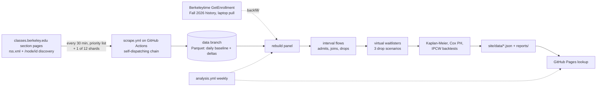

# Berkeley Waitlist Odds

Given a UC Berkeley course and a waitlist position, how likely is that spot to clear before the last automatic waitlist run, and by when? This project records enrollment and waitlist counts for course sections every 30 minutes across the Spring 2027 enrollment cycle, reconstructs waitlist flows from those counts, and fits survival models (Kaplan-Meier, Cox proportional hazards) for time to clear. The end product is a static lookup page for students. Until Spring 2027 waitlists start clearing, the page is fed from the finished Fall 2026 cycle as recorded in Berkeleytime's public enrollment history, labelled as such.

**Live site:** https://oliver139-chinesemole.github.io/berkeley-waitlist-odds/

## Status (2026-09-20)

The scraper has run on GitHub Actions since 2026-09-19 against Fall 2026 as the test term: about 917 priority-list sections plus one of 12 shards of the remaining live sections every 30 minutes, kept on cadence by a self-dispatching workflow chain (docs/RUNBOOK.md section 2). The Spring 2027 switch happens on Oct 4 through the `SCRAPE_TERM` repository variable (docs/RUNBOOK.md step 7); Phase 1 opens Oct 26; the scraper must be collecting Spring 2027 by Mon Oct 12, 2026.

The analysis code is complete and, since 2026-09-20, has real numbers to work on: Fall 2026 is a finished enrollment cycle, and Berkeleytime serves every section's enrollment history through its public API, so `make backfill` pulls that history, `make backfill-analysis` runs the whole pipeline on it, and `make backtest` freezes the model on earlier joiners and scores later ones (docs/dev/BACKFILL_BACKTEST.md, docs/DESIGN_A5.md section 9). The backfilled data lives under `backfill/` (gitignored: it is Berkeleytime's), is labelled `berkeleytime_history` everywhere it appears, and is never counted toward this project's own collection claims. What is done and what is left is kept in docs/dev/HANDOFF.md.

On novelty: Berkeleytime already records enrollment and waitlist counts and exposes the history publicly. Collecting snapshots is not new. What this project adds is the waitlist-clearing model, the lookup tool, an honest backtest, and a dataset collected under a pinned schema with every gap logged. The last point is not decoration: the pilot pull of Berkeleytime's Fall 2026 history found that its recorder was dark for every section from 2026-08-19 22:45 UTC to 2026-09-01 18:30 UTC, the end of the adjustment period and the first week of instruction, which is when waitlists move most. Fall 2026 can therefore validate Phase 1 and Phase 2 clearing but says nothing about first-week clearing; the Spring 2027 collection, with its 30-minute cadence and gap log, is what closes that hole.

## Pipeline



1. Every 30 minutes a GitHub Actions job (`scrape.yml`) fetches section counts. Sources in priority order: the SIS Class API (needs credentials; API Central declined the request on 2026-09-19 because it does not grant access to students, so the adapter is dormant), classes.berkeley.edu section pages (the primary; sections are discovered through the site's own `rss.xml` feed and `/node/<id>` pages, never its `/search/` listing, which robots.txt disallows), Berkeleytime (local cross-check, and the source of the Fall 2026 backfill: its ids are SIS ids for `GetEnrollment`, but it blocks GitHub's runners, so the pull runs from a laptop).
2. Rows are validated against a pinned pyarrow schema (`scraper/schema.py`) and written as one Parquet file per run to the `data` branch: a full baseline once per UTC day, change-only deltas otherwise. Files are never rewritten.
3. `scraper/rebuild.py` reconstructs the full panel (every section at every run) from baseline plus deltas and marks cells that were not observed, so they can be censored instead of read as zero flow. `analysis/backfill.py` builds the same panel from Berkeleytime's run-length history, with that recorder's outages censored.
4. A daily monitor job (`monitor.yml`) computes the largest gap between snapshots in the last 24 hours and opens an issue if it exceeds 90 minutes or fewer than 40 runs landed.
5. `analysis/flows.py` reconstructs waitlist flows (admits, joins, drops under FIFO assumptions), `analysis/cohort.py` and `analysis/survival.py` fit Kaplan-Meier curves and a Cox model with lifelines, `analysis/backtest.py` scores frozen models on held-out joiners with inverse-probability-of-censoring weights, `analysis/export.py` writes the precomputed JSON, and `analysis.yml` commits it every Sunday and redeploys the GitHub Pages site under `site/`.

## Run it locally

```
python3.12 -m venv .venv
source .venv/bin/activate
pip install -r requirements.txt
python -m pytest -q
python -m scraper.fetch --term "Fall 2026" --source classes_site --limit 25 --dry-run
```

The tests are offline and use recorded fixtures from `data/fixtures/`. The dry run fetches 25 Fall 2026 sections from classes.berkeley.edu at one request per second, prints a summary, and writes nothing. It identifies itself with a User-Agent that includes a contact email. It uses the Python standard library HTTP client because the site rejects the TLS handshake that `requests` and `httpx` produce (docs/PHASE0.md).

## Analysis

`analysis/` reconstructs waitlist flows from the snapshots. `make flows TERM=2268` rebuilds the panel from a checkout of the `data` branch at `./data-branch`, classifies every interval between consecutive observations into admits, joins, drops and direct enrolments (docs/DESIGN_A4.md), and writes `analysis/out/flows_<term>.parquet` with a summary. The assumptions behind the reconstruction, and the synthetic validation of them, are in docs/ASSUMPTIONS.md. `make analysis TERM=<term_id>` then builds the virtual-waitlister cohort (joiners placed at positions 1 to 100 wherever a waitlist could be joined), fits Kaplan-Meier curves and a Cox model with its proportional-hazards check, scores joins after Phase 2 opened out of sample at 14 days, and writes tables, figures, `site/data/*.json` and `analysis/out/<term>/report.md` (docs/DESIGN_A5.md).

The same pipeline runs on a finished term from Berkeleytime's history:

```
make backfill-pilot                 # 300 sections, about 10 minutes, laptop only
make backfill                       # every eligible Fall 2026 section; resumable
make backfill-analysis TERM=2268    # analysis/out/2268, site/data labelled berkeleytime_history
make backtest TERM=2268             # reports/backtest_2268/: temporal and grouped splits
```

The backtest scores five predictors at each held-out joiner's own horizon (the last automatic waitlist run, the first day of instruction, or a fixed number of days): the position bucket alone, the department-and-bucket curve the site serves, the course-and-bucket curve, the number the first version of the site would have shown, and the Cox model. On Fall 2026 the course-level curve did not beat the bucket baseline, so the site serves department curves with each course's own case count alongside. Scores are IPCW Brier, weighted AUC and decile calibration, with a section bootstrap on the gain over the baseline; `tests/test_backtest.py::test_ipcw_toy_example` shows why rows with an unknown outcome are reweighted rather than dropped.


*Simulated waitlists, not real data* (`python -m analysis.validation_figure`): left, cumulative admits in one section, true versus reconstructed from the sampled counts; right, true versus estimated hours to clear for every simulated student who cleared, under the central drop scenario. The Fall 2026 hero plot replaces this once the full backfill has run.

## Data layout (on the `data` branch)

```
snapshots/date=YYYY-MM-DD/HHMM-baseline.parquet   every observed section; first run of the UTC day
snapshots/date=YYYY-MM-DD/HHMM-delta.parquet      rows whose counts changed since the previous observation, plus tombstones
catalog/<term_id>/catalog.json                    section universe for the term (classes_site only): page paths, learned SIS section ids, node ids and 404 markers, found through the site's rss.xml feed and /node/<id> enumeration
catalog/site.json                                 discovery watermark (highest node id probed and seen) and node ids to retry
status.json                                       summary of the last run
```

One row per section per run: `fetched_at, term_id, section_id, course_key, subject, catalog_number, class_number, section_number, component, is_primary, session_id, enrolled_count, enroll_capacity, waitlist_count, waitlist_capacity, reserved_count, open_reserved, status, section_status, source`. Each file carries metadata: run start time, term, source, kind, scope, shard, and the ids that failed to fetch. Definitions are in docs/DESIGN_A2.md.

Backfilled Berkeleytime history is not on the data branch and not in the repository. `make backfill` writes it under `backfill/raw/<term_id>/` (gzip JSON per section) and `backfill/<term_id>/` (`panel.parquet`, `identity.parquet`, `gaps.parquet`, `flows.parquet`, `gap_report.csv`, `meta.json`); anyone can regenerate it with the same commands.

## Limitations

- The data is aggregate counts, not individual positions. Nobody observes "position 12 cleared". Flows are reconstructed under stated assumptions (FIFO ordering, net flows within an interval, three scenarios for where unobserved drops sat on the list) and are lower bounds.
- From classes.berkeley.edu only a priority list of about 900 sections (`config/priority_courses.txt`) is observed every 30 minutes. The rest rotate through 12 shards, so each is observed about every 6 hours. The SIS API would remove this limit, but API Central does not grant it to students.
- Reserved seats break pure FIFO. A waitlist can sit still while open seats exist.
- GitHub Actions schedules drift and sometimes skip runs. Gaps are logged in docs/DATA_LOG.md and treated as censoring, not as zero flow. Berkeleytime's own gaps in the Fall 2026 history are treated the same way, and the largest of them (Aug 19 to Sep 1, 2026, every section) removes the first week of instruction from what Fall 2026 can say.
- One enrollment cycle at a time. Fall 2026 numbers stand in for Spring 2027 until this project's own data exist; policies, capacities and demand change between terms.

## Documents

- docs/dev/HANDOFF.md: what is done, what is left, and how to resume a working session.
- docs/dev/BACKFILL_BACKTEST.md: the plan for the Fall 2026 backfill and the backtests, with what each step found.
- docs/PHASE0.md: the sources that were probed, what each returns, rate limits, and the Spring 2027 calendar.
- docs/DESIGN_A2.md: the build contract for the scraper and storage; docs/DESIGN_A4.md, docs/DESIGN_A5.md and docs/DESIGN_A6.md for the flow reconstruction, the survival analysis (with the backfill and backtest in section 9) and the site.
- docs/ASSUMPTIONS.md: the assumptions behind the reconstruction, with the numbers from the synthetic validation.
- docs/RUNBOOK.md: go-live checklist, how a run picks a source, what to do when one fails, the weekly check.
- docs/DATA_LOG.md: outages, schema changes, source switches, and the backfill decisions.
- CLAIMS.md: every resume claim and the command that checks it.

## Contact

Oliver Guo, oliver139@berkeley.edu.
